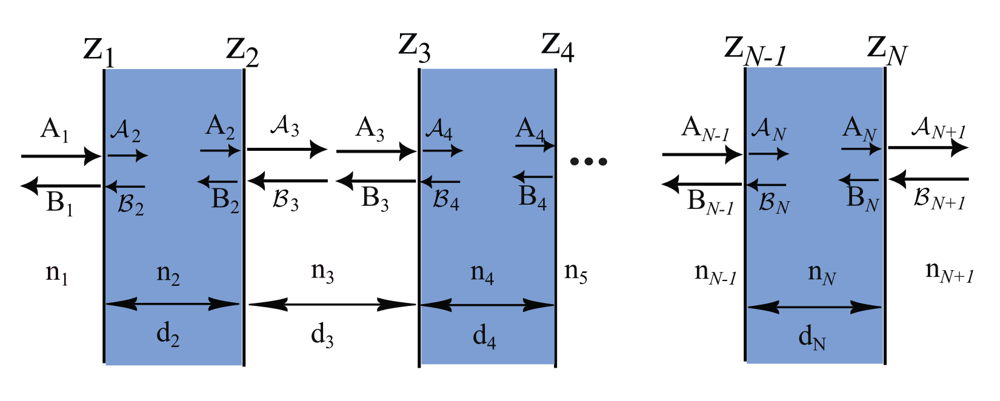
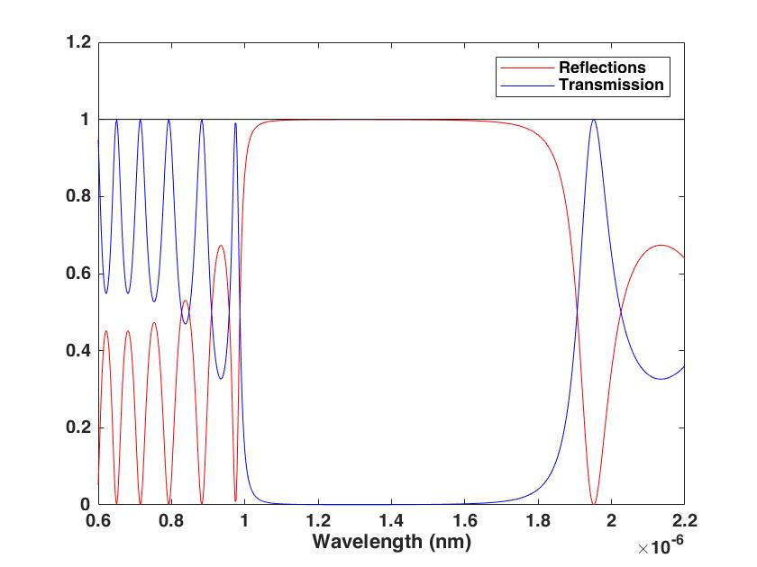
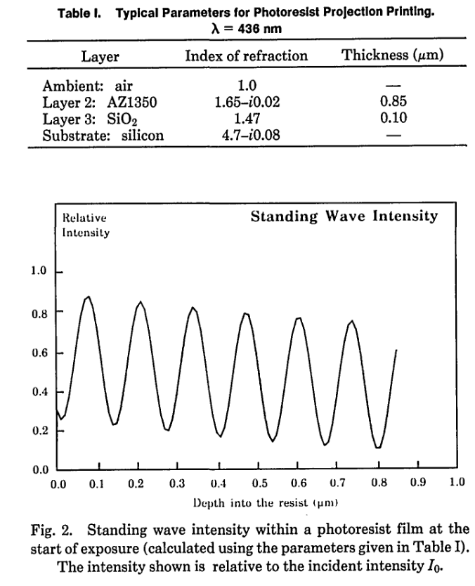
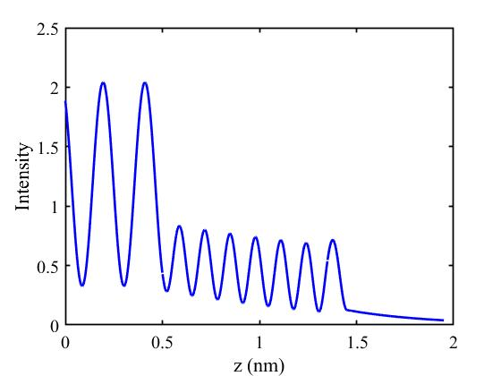

# Transfer and Scattering Matrix Implementation for Plane-Wave Scattering in Multilayer Structures (MATLAB)

This repository provides a **self-consistent and numerically robust MATLAB implementation** of the **transfer matrix method (TMM)** and the **scattering matrix method (SMM)** for plane-wave propagation and scattering in one-dimensional multilayer structures.

The implementation supports:
- TE and TM polarizations  
- Complex refractive indices (lossy materials)  
- Accurate reconstruction of **internal field distributions**  
- Direct comparison between TMM and SMM formulations  

The two methods are implemented using **identical field definitions and boundary conventions**, ensuring that they produce the **same physical results** when applied consistently.

---

## 1. Physical Model and Field Representation

We consider a multilayer structure composed of \( N \) homogeneous layers along the \( z \)-direction.  
The first and last layers are semi-infinite.

In each layer \( m \), the field is written as a superposition of forward- and backward-propagating plane waves:

\[
E_m(z)=A_m e^{i k_{m,z}(z-z_m)}+B_m e^{-i k_{m,z}(z-z_m)},
\]

where:
- \( A_m \) and \( B_m \) are the complex field amplitudes
- \( k_{m,z} = \sqrt{(k_0 n_m)^2 - k_\parallel^2} \)
- \( z_m \) is the **right interface position of layer \( m \)**

> **Important convention**  
> For all finite layers, the coefficients \( (A_m,B_m) \) are defined at the **right boundary** of the layer.  
> For the last semi-infinite layer, they are defined at the **left boundary**.  
>
> This convention is used consistently in both the TMM and SMM implementations and is essential for correct field reconstruction.

---

## 2. Transfer Matrix Method (TMM)

### 2.1 Interface and Propagation Matrices

The boundary conditions between adjacent layers relate the field coefficients through:

\[
\begin{pmatrix}
A_{m-1} \\
B_{m-1}
\end{pmatrix}
=
D_{m-1}^{-1} D_m
\begin{pmatrix}
\mathcal{A}_m \\
\mathcal{B}_m
\end{pmatrix}
=
D_{m-1}^{-1} D_m P_m
\begin{pmatrix}
A_m \\
B_m
\end{pmatrix}.
\]

The polarization-dependent interface matrices are:

**TE polarization**
\[
D_m^{\mathrm{TE}}=
\begin{pmatrix}
1 & 1 \\
n_m \cos\theta_m & -n_m \cos\theta_m
\end{pmatrix}
\]

**TM polarization**
\[
D_m^{\mathrm{TM}}=
\begin{pmatrix}
\cos\theta_m & \cos\theta_m \\
n_m & -n_m
\end{pmatrix}
\]

The propagation matrix of layer \( m \) with thickness \( d_m \) is:

\[
P_m=
\begin{pmatrix}
e^{-i k_{m,z} d_m} & 0 \\
0 & e^{i k_{m,z} d_m}
\end{pmatrix}.
\]

---

### 2.2 Global Transfer Matrix

By cascading all interfaces and propagation matrices, we obtain the global transfer matrix:

\[
\begin{pmatrix}
A_1 \\
B_1
\end{pmatrix}
=
T_{1\rightarrow N+1}
\begin{pmatrix}
\mathcal{A}_{N+1} \\
\mathcal{B}_{N+1}
\end{pmatrix}.
\]

The boundary conditions are:

- **Left incidence:**  
  \( A_1 = 1,\; \mathcal{B}_{N+1}=0 \)
- **Right incidence:**  
  \( B_1 = 1,\; \mathcal{A}_{N+1}=0 \)

---

### 2.3 MATLAB Implementation

- `CoeAB_layer_TMM`  
  Computes the field coefficients \( (A_m,B_m) \) in every layer using the transfer matrix method.

- `Get_Field_From_ABCoe`  
  Reconstructs the spatial field distribution from the AB coefficients using the same reference-plane convention.

---

## 3. Scattering Matrix Method (SMM)

### 3.1 Local Scattering Matrix

At the interface between layers \( m \) and \( m+1 \), the incoming and outgoing waves are related by:

\[
\begin{pmatrix}
B_m \\
A_{m+1}
\end{pmatrix}
=
\begin{pmatrix}
r_m^{L} & t_m^{R} \\
t_m^{L} & r_m^{R}
\end{pmatrix}
\begin{pmatrix}
A_m \\
B_{m+1}
\end{pmatrix}.
\]

The Fresnel coefficients \( r^{L,R} \) and \( t^{L,R} \) depend on the polarization and refractive indices of the adjacent layers.

---

### 3.2 Propagation Scattering Matrix

Propagation through a homogeneous layer of thickness \( d_m \) introduces a phase delay:

\[
S_m^{\mathrm{prop}}=
\begin{pmatrix}
0 & e^{i k_{m,z} d_m} \\
e^{i k_{m,z} d_m} & 0
\end{pmatrix}.
\]

---

### 3.3 Cascading Scattering Matrices

The total scattering matrix is obtained by cascading all interface and propagation matrices using the **Redheffer star product**:

\[
S = S_N \star S_{N-1} \star \cdots \star S_1.
\]

The global relation reads:

\[
\begin{pmatrix}
B_1 \\
A_{N+1}
\end{pmatrix}
=
\begin{pmatrix}
S_{11} & S_{12} \\
S_{21} & S_{22}
\end{pmatrix}
\begin{pmatrix}
A_1 \\
B_{N+1}
\end{pmatrix}.
\]

For left incidence \( (A_1=1,\,B_{N+1}=0) \):

\[
r = B_1 = S_{11}, \qquad
t = A_{N+1} = S_{21}.
\]

---

### 3.4 Internal Field Reconstruction

Once the incoming and outgoing amplitudes are fixed, the internal coefficients \( (A_m,B_m) \) are obtained by back-propagating through the cascaded scattering matrices.

Because the AB coefficients are defined using the same reference planes as in the TMM formulation, **the same field reconstruction function** can be used:

- `Get_Field_From_ABCoe`

Thus, the TMM and SMM produce **identical spatial field distributions** when applied consistently.

---

## 4. Numerical Examples

### 4.1 Bragg Mirror: Transmission and Reflection Spectrum

`BraggMirror_1D.m`

The transmission and reflection spectra computed using TMM are in excellent agreement with results obtained by the RCWA method:

- RCWA implementation:  
  https://github.com/knifelees3/RCWA-MATLAB

---

### 4.2 Field Distribution in Photoresist

`BenchMark_REF1985.m`

This example computes the standing-wave field distribution inside a photoresist layer and reproduces the analytical results reported in:

C. A. Mack, *Applied Optics* **25**, 1958–1961 (1986).

  

---

## 5. Summary

- The transfer matrix and scattering matrix methods are mathematically equivalent
- The scattering matrix formulation provides superior numerical stability for thick or lossy structures
- A consistent definition of field coefficients enables exact reconstruction of internal fields
- This implementation allows direct comparison between TMM, SMM, and RCWA results

---

## References

1. Han Li, *Transfer Matrix Approach to Propagation of Angular Plane Wave Spectra Through Metamaterial Multilayer Structures*, University of Dayton (Thesis)  
2. C. A. Mack, *Analytical expression for the standing wave intensity in photoresist*, Applied Optics **25**, 1958–1961 (1986)
