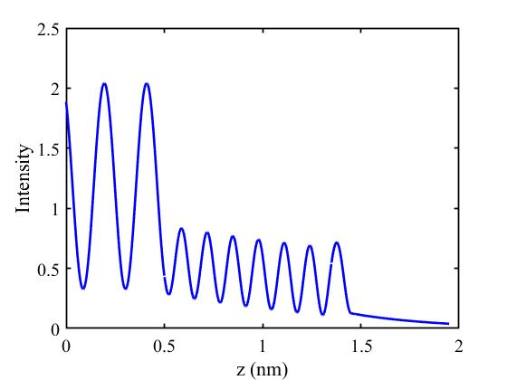

# Transfer Matrix (MATLAB)
Transfer matrix methods for plane wave transmission in multi-layer structures.

## Theoretical formulation

The field in these multi-layer structures can be written in a superposition of planes waves propagating in directions $\pm z$

$$
E(z)=\left[\begin{matrix}
A_1 e^{i \left(\left(z-z_1\right) k_{1 z}\right)}+B_0 e^{-i \left(\left(z-z_1\right) k_{1 z}\right)},z<z_1\\
A_m e^{i \left(k_{\text{mz}} \left(z-z_m\right)\right)}+B_m e^{-i \left(k_{\text{mz}} \left(z-z_m\right)\right)},z_{m-1}<z<z_m\\
A_{N+1}^{`}e^{i \left(\left(z-z_1\right) k_{N+1,z}\right)}+B_{N+1}^{'}e^{-i \left(\left(z-z_N\right) k_{N+1,z}\right)}
\end{matrix}\right.
$$

The field coefficients can be related via boundary conditions

$$
\left(
\begin{array}{c}
 A_{m-1} \\
 B_{m-1} \\
\end{array}
\right)=D_{m-1}^{-1}D_{m}
\left(
\begin{array}{c}
 A_{m}^{'} \\
 B_{m}^{'} \\
\end{array}
\right)=
D_{m-1}^{-1}D_{m}P_{m}
\left(
\begin{array}{c}
 A_{m} \\
 B_{m} \\
\end{array}
\right),m=1,2,3
$$

 where
 
$$
D_m^{\text{TE}}=\left(
\begin{array}{c}
 1 \\
 \text{cos$\theta $}_m \sqrt{\frac{\epsilon _m}{\mu _m}} \\
\end{array}
\right) \left(
\begin{array}{c}
 1 \\
 \text{cos$\theta $}_m \left(-\sqrt{\frac{\epsilon _m}{\mu _m}}\right) \\
\end{array}
\right)
$$

$$
D_m^{\text{TM}}=\left(
\begin{array}{c}
 \text{cos$\theta $}_m \\
 n_m \\
\end{array}
\right) \left(
\begin{array}{c}
 \text{cos$\theta $}_m \\
 -n_m \\
\end{array}
\right)
$$

$$
P_m=\left(
\begin{array}{c}
 e^{d_m \left(-\text{ik}_{\text{mx}}\right)} \\
 0 \\
\end{array}
\right) \left(
\begin{array}{c}
 0 \\
 e^{d_m \text{ik}_{\text{mx}}} \\
\end{array}
\right)
$$

Therefore, the field relation between field components in left and right space are

$$
\begin{aligned}
& \left(\begin{array}{l}
A_1 \\
B_1
\end{array}\right)=D_1^{-1} D_2\left(\begin{array}{l}
A_2^{\prime} \\
B_2^{\prime}
\end{array}\right)=D_1^{-1} D_2 P_2\left(\begin{array}{l}
A_2 \\
B_2
\end{array}\right) \\
& =D_1^{-1} D_2 P_2 D_2^{-1} D_3 P_3 \ldots D_N P_N D_N^{-1} D_{N+1}\left(\begin{array}{l}
A_{N+1}^{\prime} \\
B_{N+1}^{\prime}
\end{array}\right) \\
& =M_{1 \text { toN+1 }}\left(\begin{array}{l}
A_{N+1}^{\prime} \\
B_{N+1}^{\prime}
\end{array}\right)
\end{aligned}
$$

The general boundary conditions should be

$$
A_1=1, B_{N+1}^{`}=0,
B_1=1, A_{N+1}^{`}=0
$$

**References:** TRANSFER MATRIX APPROACH TO PROPAGATION OF ANGULAR PLANE WAVE SPECTRA THROUGH METAMATERIAL MULTILAYER STRUCTURES, Han Li, UNIVERSITY OF DAYTON, Thesis

`CoeAB_layer_TMM`: This function calculates the field coefficients in different layers.

`field_layer_from_ABCoe`: This function calculates the exact field distributions with given AB coefficients.

## Examples

### Transmission and Reflections Coefficients of Brag Mirror

`BragMirror_1D.m`

Can be compared with the [RCWA methods](https://github.com/knifelees3/RCWA-MATLAB)

### Field in photoresist

`BenchMark_REF1985.m`_

This program simulates the field in photoresist and can be compared with reference [2]:

[2]Mack, C. A. Analytical expression for the standing wave intensity in photoresist. *Appl. Opt., AO* **25**, 1958–1961 (1986).
